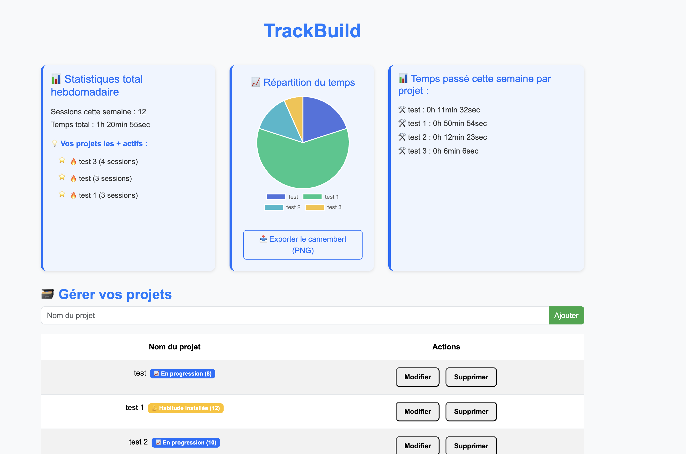

# 🕒 TrackBuild

**TrackBuild** est une application web simple et intuitive qui permet de **suivre le temps passé sur différents projets**, en catégorisant les sessions par projet. C’est un outil personnel pensé pour les développeurs, les étudiants ou les freelances souhaitant mieux gérer leur productivité.

---

## 🚀 Fonctionnalités

-   🎯 Sélection d’un projet actif via un menu déroulant
-   ▶️ Lancement / ⏹️ arrêt du chronomètre
-   📅 Enregistrement automatique de chaque session avec :
    -   Date
    -   Durée
-   🧠 Affichage de l’historique des sessions par projet
-   ⌛ Calcul automatique du temps total passé sur chaque projet
-   💾 Sauvegarde des données via `localStorage`
-   ⚙️ Interface simple, rapide et responsive (HTML, SCSS, JS)

---

## 🧰 Stack technique

-   **HTML5** – structure de l’application
-   **SCSS** – styles modulaires et propres
-   **JavaScript (Vanilla)** – logique métier et manipulation du DOM
-   **localStorage** – persistance des données côté client

---

## 🔧 Installation

1. **Clone le dépôt :**

```bash
git clone https://github.com/Alyaesub/trackbuild.git
```

2. **Ouvre le projet dans ton navigateur :**

```bash
cd trackbuild
```

Puis double-clique sur `index.html`  
_(ou sers-le avec Live Server si tu bosses en local avec VS Code)_

## ✅ Aucun build nécessaire. C’est du pur front-end !

## 🔧 Fonctionnement

1. Crée un projet via l’interface ou sélectionne-en un existant.
2. Démarre le timer en cliquant sur "Start".
3. Clique sur "Stop" pour enregistrer la session.
4. Consulte l’historique dans la section dédiée.
5. Le temps total est automatiquement mis à jour.

---

## 📂 Structure des fichiers

/trackbuild
│
├── index.html # Page principale
├── style.scss # Fichier de styles SCSS
├── script.js # Logique principale (DOM, timer, stockage)
├── /assets # Icônes, images (si présents)
└── README.md # Ce fichier

// 📁 storage.js
// --> contient saveProjects(), loadProjects()

// 📁 projects.js
// --> contient buttonAddProject, deleteProject(), modifyProject()

// 📁 session.js
// --> contient displayProjectHistory(), toggleTimer(), getSessionsThisWeek(), etc.

// 📁 timer.js
// --> contient la logique du bouton Start/Stop

// 📁 toast.js
// --> contient showToast(message, type)

// 📁 stats.js
// --> contient displayWeeklyStats(), displayWeeklyStatsByProject(), displayTimeDistributionChart(), updateTopProjectsThisWeek()

// 📁 export.js
// --> contient l'export CSV

---

## 🤝 Contribuer

Les contributions sont les bienvenues !  
Tu peux :

-   Corriger des bugs
-   Proposer des améliorations de l’interface
-   Ajouter de nouvelles fonctionnalités (export, base de données, graphique, etc.)

### Pour contribuer :

1. Fork le projet
2. Crée une branche avec ta feature :

```bash
git checkout -b ma-feature
```

3. Commit tes modifs :

```bash
git commit -m "Ajout d'une nouvelle fonctionnalité"
```

4. Push :

```bash
git push origin ma-feature
```

5. Ouvre une Pull Request ✨

---

## 💡 Idées futures

-   [x] Export des sessions au format CSV / JSON
-   [x] Ajout de catégories ou tags personnalisés
-   [ ] Synchronisation avec une base de données distante (ex : SQLite ou MongoDB)
-   [x] Interface avec graphiques (ex : Recharts, Chart.js)
-   [ ] Authentification pour version multi-utilisateur
-   [ ] Portage en application bureau (Electron)

---

## 📸 Aperçu



---

## 👨‍💻 Auteur

Développé avec ❤️ par [Pascal - Code & Co Solutions](https://github.com/Alyaesub)  
🐑 Berger la journée, développeur la nuit.

---

## 📜 Licence

Ce projet est sous licence MIT.  
Utilisation libre tant que tu ne dis pas que tu l’as codé tout seul 😄
